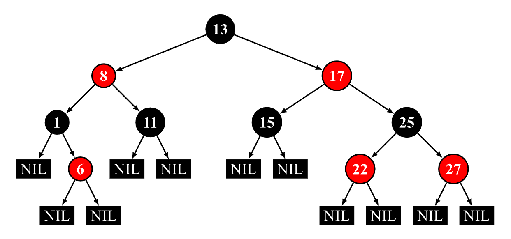

### 红黑树

##### 定义

> 一种自平衡的二叉搜索树。每个节点额外存储了一个 color 字段 ("RED" or "BLACK")，用于确保树在插入和删除时保持平衡。
>
> 红黑树是 4 阶 B 树（[2-3-4 树](https://oi-wiki.org/ds/2-3-4-tree/)）的变体。

**一棵合法的红黑树必须遵循以下四条性质**：

1. 所有节点为红色或黑色
2. `NIL` 节点（空叶子节点）为黑色
3. 红色节点的子节点为黑色
4. 从根节点到 `NIL` 节点的每条路径上的黑色节点数量相同

下图为一个合法的红黑树：



##### 实现(C++)

```cpp
#include <iostream>


```

