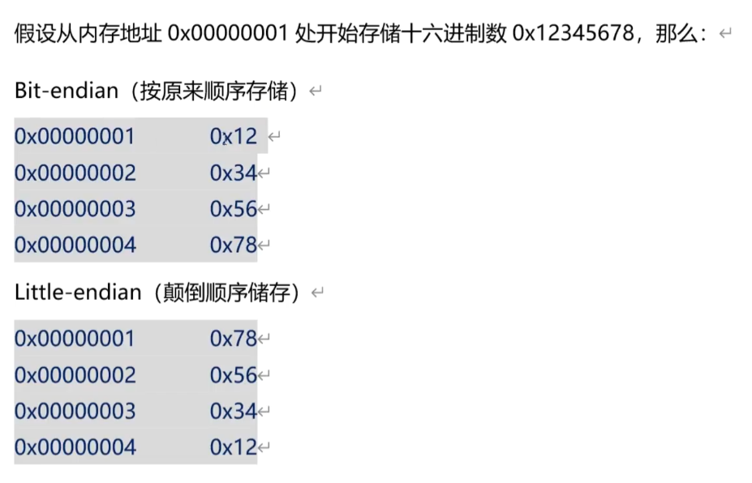

### 基本函数和结构体

1. 创建socket
    `int socket(int domain, int type, int protocol)`
        成功返回`0`；失败返回`-1`，同时设置错误代码`errno`。
        单个进程能够创建`socket`连接的数量受系统参数`open files`的限制（使用`ulimit -a`查看）。因为`socket`在`Linux`中也是文件
    - `domain`:通信协议族
        - `PF_INET`:`ipv4`协议族
        - `PF_INET6`:`ipv6`协议族
        - `PF_LOCAL`:本地通信的协议族
        - `PF_PACKET`:内核底层的协议族
        - `PF_IPX`:`IPX Novel`协议族
        - 其余协议族不常用
    - `type`:数据传输的类型
        - `SOCK_STREAM`:面向连接的`socket`，
            - 数据不会丢失
            - 数据顺序不会错乱
            - 双向通道
        - `SOCK_DGRAM`:无连接的`socket`，
            - 传输效率更高
            - 数据可能丢失
            - 数据顺序可能错乱
    - `protocal`:最终使用的协议
        - 在`ipv4`协议族中，数据传输方式为`SOCK_STREAM`的协议只有`IPPROTO_TCP`，数据传输方式为`SOCK_DGRAM`的协议只有`IPPROTO_UDP`.
        - 该参数也可以为0

2. `TCP`和`UDP`.[[TCP协议和UDP协议]]

3. 主机字节序和网络字节序
    - 主机字节序：分为**大端序**和**小端序**。
        每个地址内放`1Byte`（`8bit`），大端序和小端序讨论多个字节(`Byte`)的地址高低问题
        - 大端序：<mark>低高高低</mark>.
            ==低位==`Byte`存放在==高位==，==高位==`Byte`存放在==低位==.
        - 小端序：<mark>低低高高</mark>.
            ==低位==`Byte`存放在==低位==，==高位==`Byte`存放在==高位==.
            
            总结：**大端序按照原来顺序存储，小端序按字节颠倒顺序存储**。
        - 造成的问题：同样的数据，大端序的计算机和小端序的计算机解析方式不同，那么得到的内容也不一样。在网络传输中，容易出现问题。
    - **网络字节序（大端序）**：解决不同字节序的计算机之间传输数据的问题
        C语言提供了四个函数用于网络字节序和主机字节序的转换：
        - `uint16_t htons(uint16_t hostshort)`:将16位的整数从*主机字节序*转换为*网络字节序*。
        - `uint32_t htonl(uint32_t hostlong)`:将32位的整数从*主机字节序*转换为*网络字节序*。
        - `uint16_t stohs(uint16_t netshort)`:将16位的整数从*网络字节序*转换为*主机在字节序*。
        - `uint32_t stohl(uint32_t netlong)`:将32位的整数从*网络字节序*转换为*主机字节序*。
            `h: host`主机
            `n: net`网络
            `s: short`2字节，16位的整数
            `l: long`4字节，32位的整数

4. ` ip`地址和通讯端口`port`.
    `ipv4`地址用4字节(`32bit`)的整数存放，`port`用2字节(`16bit`)的整数存放（0～65535）。
    为什么不用字符串？
        因为`192.168.190.134`用字符串存储需要15字节，而用整数存储只需要4个字节：3232284294。（**思考`ipv4`地址最大只能到`255.255.255.255`**）

5. 万恶的结构体
        因为平时用到的`ip`地址都是字符串类型的，而程序中存储的是`int`类型那么就需要将字符串类型的ip转换为int型ip。主要涉及三个结构体和一个函数
    
    1. `sockaddr`结构体
        存储协议族、端口、地址信息。客户端的`connetc`函数和服务端的`bind`函数都要用到这个结构体。其定义类似下图：
        
        ```cpp
        struct sockaddr{
            unsigned short int sa_family;   // 协议族
            unsigned char sa_data[14];  // 14字节的端口和地址
        }
        ```
        
    2. `sockaddr_in`结构体
        上方的`sockaddr`是为了统一地址结构的表示方法，统一接口函数。但是很难用，操作不方便。所以定义了等价的`sockaddr_in`结构体，其大小与`sockaddr`相同，可以强制转换。
        ```cpp
        struct sockaddr_in{
            unsigned short int sa_family;   // 协议族
            unsigned short sin_port;  // 16bit端口号
            struct in_addr sin_addr;  // 32bit的地址(只能存储ipv4的地址，不能存储ipv6。sockaddr中14个字节的char数组就是预留了ip地址扩展的空间)
            unsigned char sin_zero[8];// 未使用，为了保持与sockaddr长度相同而添加。
        }
        struct in_addr{
            unsigned int s_addr; // 32bit的ip地址，大端序
        }
        ```
        
    3. `gethostbyname()`函数
        根据域名、主机名、字符串`ip`地址获取大端存储的`int32`类型`ip`.
        ```cpp
        struct hostent* gethostbyname(const char* name);
        ```
        
    4. `hostent`结构体
        ```cpp
        struct hostent{
            char* h_name; // 主机名
            char** h_aliases; // 主机所有别名构成的的字符串数组。（同一个ip可以绑定多个域名）
            short h_addrtype; // 主机ip地址的类型，如ipv4(AF_INET)还是ipv6
            short h_length; // 主机ip地址长度，ipv4为4(字节),ipv6为16(字节)
            char** h_addr_list; // 主机的ip地址，以网络字节序存储
        }
        ```
        获取`hostent`后，使用以下代码把大端序的地址复制到`sockaddr_in`结构体的`sin_addr`成员中
        ```cpp
        sockaddr_in serveraddr;
        struct hostent* h = gethostbyname("192.168.1.2"); 
        memcpy(&serveraddr.sin_addr, h->h_addr_list, h->h_length);
        ```
    
6. 字符串`ip`转大端序`ip`.
    C语言提供了几个库函数，用于字符串`ip`和大端序`ip`的相互转换。通常用于网络通讯的服务端程序中。
    ``` cpp
    typedef unsigned int uint32;
    
    // 把字符串格式的ip转换成大端序的ip，转换后的ip应该赋值给 sockaddr_in.in_addr.s_addr。不能传入域名
    uint_32 inet_addr(const char* cp);
    
    // 将字符串格式的ip转换为大端序的ip，转换后的ip直接填充到sockaddr_in.in_addr成员（不需要手动填充）。不能传入域名 
    int inet_aton(const char* cp, struct int_addr * inp);
    
    // 将大端序ip转换为字符串格式的ip。用于在服务器程序中解析客户端的ip地址  
    char* inet_ntoa(struct in_addr in);
    ```

7. `bind`函数
    绑定服务端的`ip`和端口，失败返回-1

    ```cpp
    struct sockaddr server_addr;
    bind(listenfd, (struct sockaddr *)&server_addr, sizeof(server_addr))
    ```

8. `lieten`函数
    把socket设置为可连接(监听)的状态，失败返回-1
    `listen(listenfd, 5)`

### 封装socket客户端
``` cpp
#include <iostream>

#include <sys/socket.h>
#include <arpa/inet.h>
#include <unistd.h>
#include <memory.h>
#include <netdb.h>

using namespace std;

class tcpClient {
public:
    int client_sock;        // 客户端socket，-1表示未连接或者已断开。>=0表示有效的socket
    string ip;              // 服务端的ip或域名
    unsigned short port;    // 通讯端口

    tcpClient() : client_sock(-1), port(-1) {}

    ~tcpClient() {
        if (client_sock != -1) {
            close();
        }
    }

    /**
     * @param in_ip 客户端ip/域名
     * @param in_port 端口号
     * @return 成功返回true，失败返回false
     */
    bool connect_to(const string &in_ip, const unsigned short in_port) {
        if (client_sock != -1) {
            cout << "ERROR: sock connect is already exist" << endl;
            return false;
        }
        // 保存服务端ip和端口号
        ip = in_ip;
        port = in_port;

        // 创建客户端Socket
        client_sock = socket(AF_INET, SOCK_STREAM, 0);
        if (client_sock == -1) {
            cout << "创建Socket失败" << endl;
            return false;
        }

        // 配置服务器地址
        sockaddr_in server_addr{};
        memset(&server_addr, 0, sizeof(server_addr));
        server_addr.sin_family = AF_INET;
        server_addr.sin_port = htons(port);
        // server_addr.sin_addr.s_addr = inet_addr(in_ip.c_str());      // 该方法只能用ip，不能用域名

        struct hostent *h;          // 用于存放服务端的大端序ip的结构体的指针
        if ((h = gethostbyname(ip.c_str())) == nullptr)      // 把域名、主机名、字符串格式的ip转换为结构体，存储在h中
        {
            ::close(client_sock);     // 关闭sock连接
            client_sock = -1;
            return false;
        }

        memcpy(&server_addr.sin_addr, h->h_addr, h->h_length);

        // 连接服务器
        if (connect(client_sock, (sockaddr *) &server_addr, sizeof(server_addr)) == -1) {
            cout << "连接服务器失败" << endl;
            ::close(client_sock);
            return false;
        }

        return true;
    }

    bool send(const string &msg) const {
        // 参数使用string，不使用const char*，因为const char*
        if (client_sock == -1) {
            cout << "ERROR: not connected" << endl;
            return false;
        }

        // 或者：if (send(client_sock, msg.c_str(), msg.length(), 0))      // 语义不准确：buffer可以是string，也可以是一块内存
        if (::send(client_sock, msg.data(), msg.size(), 0) == -1) {
            cout << "ERROR: send failed" << endl;
            return false;
        }

        return true;
    }

    /**
     *
     * @param msg 存放接收到的内容
     * @param maxLen 接收的最大长度
     * @return
     */
    bool receive(string &msg, const size_t maxLen) const {
        if (client_sock == -1) {
            cout << "ERROR: not connected" << endl;
            return false;
        }

        msg.clear();        // 清空容器
        msg.resize(maxLen);     // 设置容器大小
        /*
         * 如果直接操作string对象的内存，需要保证亮点：
         *      1. 不能越界
         *      2. 操作后需要手动设置string的大小（resize函数）。(因为直接操作string对象的内存后，string对象自动管理内存的功能就会失效)
         *
         * 传地址除了使用msg[0]，还可以使用msg.c_str()，msg.data()。
         * 但是后两种获取到的都是const类型，无法修改，而recv函数需要将收到的数据写入msg中
         */
        int read_byte_number = ::recv(client_sock, &msg[0], msg.size(), 0); // 返回接收数据的大小，-1表示失败，0表示sock已断开
        if (read_byte_number <= 0) {
            cout << "ERROR: receive failed" << endl;
            msg.clear();
            return false;
        }
        msg.resize(read_byte_number);

        return true;
    }

    bool close() {
        if (client_sock == -1) {
            cout << "ERROR: not connected" << endl;
        }
        ::close(client_sock);

        client_sock = -1;
        return true;
    }
};

int main() {
    cout << "------------------- client start -------------------" << endl;
    tcpClient tcp_client;
    string ip = "127.0.0.1";
    string port = "5005";
    if (!tcp_client.connect_to(ip, atoi(port.c_str()))) {
        perror(("connect to " + ip + ":" + port + " failed").c_str());
        return -1;
    }
    char msg[1024];

    for (int i = 0; i < 10; ++i) {
        int iret;
        memset(msg, 0, sizeof(msg));
        sprintf(msg, "test message %d", i + 1);

        // 向服务端发送请求报文
        if (!tcp_client.send(msg)) {
            char errormsg[32];
            sprintf(errormsg, "message %d send failed", i + 1);
            perror(errormsg);
        }
        cout << "send: " << msg << endl;

        string received_message;
        if (!tcp_client.receive(received_message, 1024)) {
            perror("received failed");
        }
        cout << "received: " << received_message << endl;
        sleep(1);
    }

    return 0;
}
```
### 封装socket服务端

#### 单进程单线程服务端

```cpp
#include <iostream>

#include <sys/socket.h>
#include <arpa/inet.h>
#include <unistd.h>
#include <memory.h>

using namespace std;

class tcpServer {
public:
    int listen_sock;            // 用于监听的socket。-1表示未初始化
    int client_sock;            // 客户端连上的的socket，用于和客户端通信。-1表示客户端未连接。
    string client_ip;           // 客户端的ip
    unsigned short port;        // 服务端用于通讯的端口

    tcpServer() : listen_sock(-1), client_sock(-1) {}

    ~tcpServer() {
        if (listen_sock == -1) {
            closeListen();
        }
        if (client_sock == -1) {
            closeClient();
        }
    }

    bool initServer(const unsigned short &in_port) {
        // 初始化服务端用于监听的socket
        if ((listen_sock = socket(AF_INET, SOCK_STREAM, 0)) == -1) {
            cout << "ERROR socket init failed" << endl;
            return false;
        }

        port = in_port;

        // 将服务端用于通信的ip和端口绑定到socket上
        struct sockaddr_in server_addr;
        memset(&server_addr, 0, sizeof(server_addr));
        server_addr.sin_family = AF_INET;                       // 协议
        server_addr.sin_port = htons(port);                     // 指定服务端的通信端口
        server_addr.sin_addr.s_addr = htonl(INADDR_ANY);        // 如果操作系统有多个ip，则多个ip都可以用于通信

        // 为socket绑定ip和端口
        if (bind(listen_sock, (struct sockaddr *) &server_addr, sizeof(server_addr)) == -1) {
            cout << "ERROR socket bind failed" << endl;
            close(listen_sock);
            listen_sock = -1;
            return false;
        }

        if (listen(listen_sock, 5)) {
            cout << "ERROR listening start failed" << endl;
            return false;
        }
        return true;
    }

    bool accept() {
        struct sockaddr_in client_addr;             // 客户端的地址信息
        socklen_t addrlen = sizeof(client_addr);    // struct sockaddr_in的大小
        // 注意accept函数的第三个参数是指针：因为accept函数需要将实际接收到的消息长度写回addrlen
        if ((client_sock = ::accept(listen_sock, (struct sockaddr *) &client_addr, &addrlen)) == -1) {
            perror("accept failed");
            return false;
        }

        client_ip = inet_ntoa(client_addr.sin_addr);          // 将客户端的代码从大端序转换为字符串

        return true;
    }

    bool send(const string &msg) {
        if (client_sock == -1) {
            perror("socket no connected");
            return false;
        }

        if ((::send(client_sock, msg.data(), msg.size(), 0) <= 0)) {
            perror("send message failed");
            return false;
        }

        return true;
    }

    bool recv(string &msg, const size_t maxLen) {
        msg.clear();
        msg.resize(maxLen);
        int read_byte_number = ::recv(client_sock, &msg[0], msg.size(), 0);
        if (read_byte_number <= 0) {
            msg.clear();
            perror("receive failed");
            return false;
        }
        msg.resize(read_byte_number);
        return true;
    }

    bool closeListen() {
        if (listen_sock == -1) {
            perror("not listening");
            return false;
        }
        close(listen_sock);
        listen_sock = -1;
        return true;
    }

    bool closeClient() {
        if (client_sock == -1) {
            perror("not listening");
            return false;
        }
        close(client_sock);
        client_sock = -1;
        return true;
    }

    // 获取string格式的ip地址
    [[nodiscard]] const string &clientip() const {
        return client_ip;
    }
};

int main() {
    tcpServer tcp_server;
    if (!tcp_server.initServer(5005)) {
        perror("initsServer() failed");
        return -1;
    }

    if (!tcp_server.accept()) {
        perror("accept failed");
        return -1;
    }
    cout << "client connected" << endl;

    string msg;
    while (true) {
        // 接收客户端发来的报文，如果客户端没有发来报文，recv将阻塞等待
        if (!tcp_server.recv(msg, 1024)) {
            perror("receive failed");
        }
        cout << "received: " << msg << endl;

        msg = "OK";
        // 向客户端发送报文
        if (!tcp_server.send(msg)) {
            perror("send failed");
        }
        cout << "send: " << msg << endl;
        sleep(1);
    }

    return 0;
}
```

#### 多进程服务端

```cpp
#include <iostream>

#include <sys/socket.h>
#include <arpa/inet.h>
#include <unistd.h>
#include <memory.h>

#include <csignal>

using namespace std;

class tcpServer {
public:
    int listen_sock;            // 用于监听的socket。-1表示未初始化
    int client_sock;            // 客户端连上的的socket，用于和客户端通信。-1表示客户端未连接。
    string client_ip;           // 客户端的ip
    unsigned short port;        // 服务端用于通讯的端口

    tcpServer() : listen_sock(-1), client_sock(-1) {}

    ~tcpServer() {
        if (listen_sock == -1) {
            closeListen();
        }
        if (client_sock == -1) {
            closeClient();
        }
    }

    bool initServer(const unsigned short &in_port) {
        // 初始化服务端用于监听的socket
        if ((listen_sock = socket(AF_INET, SOCK_STREAM, 0)) == -1) {
            cout << "ERROR socket init failed" << endl;
            return false;
        }

        port = in_port;

        // 将服务端用于通信的ip和端口绑定到socket上
        struct sockaddr_in server_addr;
        memset(&server_addr, 0, sizeof(server_addr));
        server_addr.sin_family = AF_INET;                       // 协议
        server_addr.sin_port = htons(port);                     // 指定服务端的通信端口
        server_addr.sin_addr.s_addr = htonl(INADDR_ANY);        // 如果操作系统有多个ip，则多个ip都可以用于通信

        // 为socket绑定ip和端口
        if (bind(listen_sock, (struct sockaddr *) &server_addr, sizeof(server_addr)) == -1) {
            cout << "ERROR socket bind failed" << endl;
            close(listen_sock);
            listen_sock = -1;
            return false;
        }

        if (listen(listen_sock, 5)) {
            cout << "ERROR listening start failed" << endl;
            return false;
        }
        return true;
    }

    bool accept() {
        struct sockaddr_in client_addr;             // 客户端的地址信息
        socklen_t addrlen = sizeof(client_addr);    // struct sockaddr_in的大小
        // 注意accept函数的第三个参数是指针：因为accept函数需要将实际接收到的消息长度写回addrlen
        if ((client_sock = ::accept(listen_sock, (struct sockaddr *) &client_addr, &addrlen)) == -1) {
            perror("accept failed");
            return false;
        }

        client_ip = inet_ntoa(client_addr.sin_addr);          // 将客户端的代码从大端序转换为字符串

        return true;
    }

    bool send(const string &msg) {
        if (client_sock == -1) {
            perror("socket no connected");
            return false;
        }

        if ((::send(client_sock, msg.data(), msg.size(), 0) <= 0)) {
            perror("send message failed");
            return false;
        }

        return true;
    }

    bool recv(string &msg, const size_t maxLen) {
        msg.clear();
        msg.resize(maxLen);
        int read_byte_number = ::recv(client_sock, &msg[0], msg.size(), 0);
        if (read_byte_number <= 0) {
            msg.clear();
            perror("receive failed");
            return false;
        }
        msg.resize(read_byte_number);
        return true;
    }

    bool closeListen() {
        if (listen_sock == -1) {
            perror("not listening");
            return false;
        }
        close(listen_sock);
        listen_sock = -1;
        return true;
    }

    bool closeClient() {
        if (client_sock == -1) {
            perror("not listening");
            return false;
        }
        close(client_sock);
        client_sock = -1;
        return true;
    }

    // 获取string格式的ip地址
    [[nodiscard]] const string &clientip() const {
        return client_ip;
    }
};

tcpServer tcp_server;

void fatherEXIT(int sig) {
    // 以下代码是为了防止信号处理函数在执行过程中再次被信号中断
    signal(SIGINT, SIG_IGN);
    signal(SIGTERM, SIG_IGN);

    cout << "父进程退出： " << sig << endl;

    kill(0, SIGTERM);

    // ---------------在这里增加释放资源的代码---------------
    tcp_server.closeListen();
    // --------------------------------------------------

    exit(0);
}

void childEXIT(int sig) {
    signal(SIGINT, SIG_IGN);
    signal(SIGTERM, SIG_IGN);

    cout << "子进程退出： " << sig << endl;

    // ------在这里增加释放资源的代码（只释放子进程的资源）------
    tcp_server.closeClient();       // 信号处理函数中只能访问全局对象，tcp_server必须定义为全局变量
    // --------------------------------------------------

    exit(0);
}

int main() {
    if (!tcp_server.initServer(5005)) {
        perror("initsServer() failed");
        return -1;
    }

    // 忽略全部信号，不希望被打扰。顺便解决僵尸进程的问题
    for (int i = 0; i < 64; ++i) {
        signal(i, SIG_IGN);
    }
    // 设置信号，在shell下可以用 'kill 进程号' 和 'Ctrl+C' 正常终止这些线程
    // 但请不要用 'kill -9 进程号' 强行终止线程
    signal(SIGTERM, fatherEXIT);
    signal(SIGINT, fatherEXIT);

    while (true) {
        // 受理(监听)客户端的连接，从已连接的客户端中取出一个客户端
        // 如果没有已连接的客户端，accept函数将阻塞等待
        if (!tcp_server.accept()) {
            perror("accept failed");
            return -1;
        }
        cout << "client connected" << endl;

        int pid = fork();
        // 系统资源不足
        if (pid == -1) {
            perror("fork");
            return -1;
        }
        if (pid > 0) {
            tcp_server.closeClient();           // 多进程下，服务器父进程不需要客户端的socket，关闭
            continue;           // 父进程返回循环开始位置，继续受理客户端连接
        }

        tcp_server.closeListen();           // 子进程不需要监听socket，关闭
        // 子进程需要重新设置信号
        signal(SIGTERM, childEXIT);         // 使用kill命令终止进程时，会产生SIGTERM信号，执行childEXIT函数
        signal(SIGINT, childEXIT);          // 按下ctrl+c会触发SIGINT信号，执行childEXIT函数

        // 子进程负责与客户端进行通讯
        string msg;
        while (true) {
            // 接收客户端发来的报文，如果客户端没有发来报文，recv将阻塞等待
            if (!tcp_server.recv(msg, 1024)) {
                perror("receive failed");
            } else {
                cout << "received: " << msg << "------thread id: " << getpid() << endl;
            }

            msg = "OK";
            // 向客户端发送报文
            if (!tcp_server.send(msg)) {
                perror("send failed");
            } else {
                cout << "send: " << msg << endl;
            }

            sleep(1);
        }

        return 0;           // 子进程通信完成后一定要退出，否则就会回到accept()函数的位置
    }

    return 0;
}
```

#### 文件传输

##### 客户端

```cpp
#include <iostream>
#include <fstream>

#include <sys/socket.h>
#include <arpa/inet.h>
#include <unistd.h>
#include <memory.h>
#include <netdb.h>
#include <sys/stat.h>

using namespace std;

class tcpClient {
public:
    int client_sock;        // 客户端socket，-1表示未连接或者已断开。>=0表示有效的socket
    string ip;              // 服务端的ip或域名
    unsigned short port;    // 通讯端口

    tcpClient() : client_sock(-1), port(-1) {}

    ~tcpClient() {
        if (client_sock != -1) {
            close();
        }
    }

    /**
     * @param in_ip 客户端ip/域名
     * @param in_port 端口号
     * @return 成功返回true，失败返回false
     */
    bool connect_to(const string &in_ip, const unsigned short in_port) {
        if (client_sock != -1) {
            cout << "ERROR: sock connect is already exist" << endl;
            return false;
        }
        // 保存服务端ip和端口号
        ip = in_ip;
        port = in_port;

        // 创建客户端Socket
        client_sock = socket(AF_INET, SOCK_STREAM, 0);
        if (client_sock == -1) {
            cout << "创建Socket失败" << endl;
            return false;
        }

        // 配置服务器地址
        sockaddr_in server_addr{};
        memset(&server_addr, 0, sizeof(server_addr));
        server_addr.sin_family = AF_INET;
        server_addr.sin_port = htons(port);
        // server_addr.sin_addr.s_addr = inet_addr(in_ip.c_str());      // 该方法只能用ip，不能用域名

        struct hostent *h;          // 用于存放服务端的大端序ip的结构体的指针
        if ((h = gethostbyname(ip.c_str())) == nullptr)      // 把域名、主机名、字符串格式的ip转换为结构体，存储在h中
        {
            ::close(client_sock);     // 关闭sock连接
            client_sock = -1;
            return false;
        }

        memcpy(&server_addr.sin_addr, h->h_addr, h->h_length);

        // 连接服务器
        if (connect(client_sock, (sockaddr *) &server_addr, sizeof(server_addr)) == -1) {
            cout << "连接服务器失败" << endl;
            ::close(client_sock);
            return false;
        }

        return true;
    }

    bool send(const string &msg) const {
        // 参数使用string，不使用const char*，因为const char*
        if (client_sock == -1) {
            cout << "ERROR: not connected" << endl;
            return false;
        }

        // 或者：if (send(client_sock, msg.c_str(), msg.length(), 0))      // 语义不准确：buffer可以是string，也可以是一块内存
        if (::send(client_sock, msg.data(), msg.size(), 0) == -1) {
            cout << "ERROR: send failed" << endl;
            return false;
        }

        return true;
    }

    /**
     * 用于传输二进制
     * @param msg 要传输的数据（可以是结构体）
     * @param size 数据大小
     * @return
     */
    bool send(void *msg, const size_t size) {
        // 参数使用string，不使用const char*，因为const char*
        if (client_sock == -1) {
            cout << "ERROR: not connected" << endl;
            return false;
        }

        // 或者：if (send(client_sock, msg.c_str(), msg.length(), 0))      // 语义不准确：buffer可以是string，也可以是一块内存
        if (::send(client_sock, msg, size, 0) == -1) {
            cout << "ERROR: send failed" << endl;
            return false;
        }

        return true;
    }

    bool sendFile(const string &filePath, const size_t fileSize) {
        ifstream fin;
        fin.open(filePath, ios::in | ios::binary);
        if (!fin.is_open()) {
            cout << "file open failed" << endl;
            return false;
        }

        int onRead = 0;         // 每次调用 fin.read() 打算读取的字节数
        int totalByte = 0;      // 从文件中已读取的总字节数
        int bufferSize = 4096;  // 缓冲区大小，单位byte
        char buffer[bufferSize];         // 存放读取数据的buffer。实际开发中，一般在1000～5000之间。

        while (true) {
            memset(buffer, 0, sizeof(buffer));
            if (fileSize - totalByte > bufferSize) {
                onRead = bufferSize;
            } else {
                onRead = fileSize - totalByte;
            }

            fin.read(buffer, onRead);
            if (!send(buffer, onRead)) {
                return false;
            }
            totalByte += onRead;

            if (totalByte == fileSize) {
                break;
            }
        }

        fin.close();
        return true;
    }

    /**
     *
     * @param msg 存放接收到的内容
     * @param maxLen 接收的最大长度
     * @return
     */
    bool receive(string &msg, const size_t maxLen) const {
        if (client_sock == -1) {
            cout << "ERROR: not connected" << endl;
            return false;
        }

        msg.clear();        // 清空容器
        msg.resize(maxLen);     // 设置容器大小
        /*
         * 如果直接操作string对象的内存，需要保证亮点：
         *      1. 不能越界
         *      2. 操作后需要手动设置string的大小（resize函数）。(因为直接操作string对象的内存后，string对象自动管理内存的功能就会失效)
         *
         * 传地址除了使用msg[0]，还可以使用msg.c_str()，msg.data()。
         * 但是后两种获取到的都是const类型，无法修改，而recv函数需要将收到的数据写入msg中
         */
        int read_byte_number = ::recv(client_sock, &msg[0], msg.size(), 0); // 返回接收数据的大小，-1表示失败，0表示sock已断开
        if (read_byte_number <= 0) {
            cout << "ERROR: receive failed" << endl;
            msg.clear();
            return false;
        }
        msg.resize(read_byte_number);

        return true;
    }

    bool close() {
        if (client_sock == -1) {
            cout << "ERROR: not connected" << endl;
        }
        ::close(client_sock);

        client_sock = -1;
        return true;
    }
};

// 通过stat结构体 获得文件大小，单位字节
size_t getFileSize(const char *fileName) {

    if (fileName == NULL) {
        return 0;
    }

    // 这是一个存储文件(夹)信息的结构体，其中有文件大小和创建时间、访问时间、修改时间等
    struct stat statbuf;

    // 提供文件名字符串，获得文件属性结构体
    stat(fileName, &statbuf);

    // 获取文件大小
    size_t filesize = statbuf.st_size;

    return filesize;
}

int main() {
    cout << "------------------- client start -------------------" << endl;
    tcpClient tcp_client;
    string ip = "127.0.0.1";
    string port = "5005";
    if (!tcp_client.connect_to(ip, atoi(port.c_str()))) {
        perror(("connect to " + ip + ":" + port + " failed").c_str());
        return -1;
    }

    // 发送文件
    // 把待传文件名和文件大小发送给服务端
    struct fileInfo {
        char fileName[256];     // 文件目录和文件名。与程序运行位置(工作目录)联系紧密，工作目录不同，fileName对应的路径也不同
        int fileSize;           // 文件大小
    } fileinfo;
    memset(&fileinfo, 0, sizeof(fileInfo));
    strcpy(fileinfo.fileName, "test.txt");
    fileinfo.fileSize = (int) getFileSize(fileinfo.fileName);
    if (!tcp_client.send(&fileinfo, sizeof(fileinfo))) {
        char errormsg[32];
        sprintf(errormsg, "fileInfo send failed");
        perror(errormsg);
        return -1;
    } else {
        cout << "发送文件信息: fileName: " << fileinfo.fileName << "  fileSize: " << fileinfo.fileSize << endl;
    }

    // 等待服务端的确认
    string buffer;
    if (!tcp_client.receive(buffer, 2)) {
        cout << "receive error" << endl;
    }
    if (buffer != "OK") {
        cout << "receive message error" << endl;
    }

    // 发送文件给服务端
    if (!tcp_client.sendFile(fileinfo.fileName, fileinfo.fileSize)) {
        cout << "file send error" << endl;
        return -1;
    }

    // 等待服务端的确认
    if (!tcp_client.receive(buffer, 2)) {
        cout << "no 'OK' received" << endl;
    }

    if (buffer != "OK") {
        cout << "ERROR receive" << endl;
    } else {
        cout << "received 'OK'" << endl;
    }

    return 0;
}
```

##### 服务端

```cpp
#include <iostream>
#include <fstream>

#include <sys/socket.h>
#include <arpa/inet.h>
#include <unistd.h>
#include <memory.h>

#include <csignal>

using namespace std;

class tcpServer {
public:
    int listen_sock;            // 用于监听的socket。-1表示未初始化
    int client_sock;            // 客户端连上的的socket，用于和客户端通信。-1表示客户端未连接。
    string client_ip;           // 客户端的ip
    unsigned short port;        // 服务端用于通讯的端口

    tcpServer() : listen_sock(-1), client_sock(-1) {}

    ~tcpServer() {
        if (listen_sock == -1) {
            closeListen();
        }
        if (client_sock == -1) {
            closeClient();
        }
    }

    bool initServer(const unsigned short &in_port) {
        // 初始化服务端用于监听的socket
        if ((listen_sock = socket(AF_INET, SOCK_STREAM, 0)) == -1) {
            cout << "ERROR socket init failed" << endl;
            return false;
        }

        port = in_port;

        // 将服务端用于通信的ip和端口绑定到socket上
        struct sockaddr_in server_addr;
        memset(&server_addr, 0, sizeof(server_addr));
        server_addr.sin_family = AF_INET;                       // 协议
        server_addr.sin_port = htons(port);                     // 指定服务端的通信端口
        server_addr.sin_addr.s_addr = htonl(INADDR_ANY);        // 如果操作系统有多个ip，则多个ip都可以用于通信

        // 为socket绑定ip和端口
        if (bind(listen_sock, (struct sockaddr *) &server_addr, sizeof(server_addr)) == -1) {
            cout << "ERROR socket bind failed" << endl;
            close(listen_sock);
            listen_sock = -1;
            return false;
        }

        if (listen(listen_sock, 5)) {
            cout << "ERROR listening start failed" << endl;
            return false;
        }
        return true;
    }

    bool accept() {
        struct sockaddr_in client_addr;             // 客户端的地址信息
        socklen_t addrlen = sizeof(client_addr);    // struct sockaddr_in的大小
        // 注意accept函数的第三个参数是指针：因为accept函数需要将实际接收到的消息长度写回addrlen
        if ((client_sock = ::accept(listen_sock, (struct sockaddr *) &client_addr, &addrlen)) == -1) {
            perror("accept failed");
            return false;
        }

        client_ip = inet_ntoa(client_addr.sin_addr);          // 将客户端的代码从大端序转换为字符串

        return true;
    }

    bool send(const string &msg) {
        if (client_sock == -1) {
            perror("socket no connected");
            return false;
        }

        if ((::send(client_sock, msg.data(), msg.size(), 0) <= 0)) {
            perror("send message failed");
            return false;
        }

        return true;
    }

    /**
     * 存放接收到的字符串数据
     * @param msg
     * @param maxLen
     * @return
     */
    bool recv(string &msg, const size_t maxLen) {
        msg.clear();
        msg.resize(maxLen);
        int read_byte_number = ::recv(client_sock, &msg[0], msg.size(), 0);
        if (read_byte_number <= 0) {
            msg.clear();
            perror("receive failed");
            return false;
        }
        msg.resize(read_byte_number);
        return true;
    }

    /**
     * 存放接收到的二进制数据
     * @param msg
     * @param maxLen
     * @return
     */
    bool recv(void *msg, const size_t maxLen) const {
        if (client_sock == -1) {
            cout << "ERROR: not connected" << endl;
            return false;
        }

        int read_byte_number = ::recv(client_sock, msg, maxLen, 0); // 返回接收数据的大小，-1表示失败，0表示sock已断开
        if (read_byte_number <= 0) {
            cout << "ERROR: receive failed" << endl;
            return false;
        }
        return true;
    }

    /**
     * 接收文件
     * @param filePath 文件路径和文件名
     * @param fileSize 文件大小
     * @return
     */
    bool receiveFile(const string &filePath, const size_t fileSize) {
        ofstream fout;
        fout.open(filePath, ios::binary | ios::out);
        fout<<"iii"<<endl;
        if (!fout.is_open()) {
            cout << "file open failed" << endl;
            return false;
        }
        int totalByte = 0;          // 已接收文件的总字节数
        int onRead = 0;             // 本次打算接收的字节数
        int bufferSize = 4096;  	// 缓冲区大小，单位byte
        char buffer[bufferSize];             // 接收文件内容的缓冲区，实际开发中，一般在1000～5000之间。

        while (true) {
            if (fileSize - totalByte > bufferSize) {
                onRead = bufferSize;
            } else {
                onRead = fileSize - totalByte;
            }

            if (!recv(buffer, onRead)) {
                return false;
            }

            fout.write(buffer, onRead);

            totalByte += onRead;

            if (totalByte == fileSize) {
                fout.close();
                break;
            }
        }

        return true;
    }

    bool closeListen() {
        if (listen_sock == -1) {
            perror("not listening");
            return false;
        }
        close(listen_sock);
        listen_sock = -1;
        return true;
    }

    bool closeClient() {
        if (client_sock == -1) {
            perror("not listening");
            return false;
        }
        close(client_sock);
        client_sock = -1;
        return true;
    }

    // 获取string格式的ip地址
    [[nodiscard]] const string &clientip() const {
        return client_ip;
    }
};

tcpServer tcp_server;

void fatherEXIT(int sig) {
    // 以下代码是为了防止信号处理函数在执行过程中再次被信号中断
    signal(SIGINT, SIG_IGN);
    signal(SIGTERM, SIG_IGN);

    cout << "父进程退出： " << sig << endl;

    kill(0, SIGTERM);

    // ---------------在这里增加释放资源的代码---------------
    tcp_server.closeListen();
    // --------------------------------------------------

    exit(0);
}

void childEXIT(int sig) {
    signal(SIGINT, SIG_IGN);
    signal(SIGTERM, SIG_IGN);

    cout << "子进程退出： " << sig << endl;

    // ------在这里增加释放资源的代码（只释放子进程的资源）------
    tcp_server.closeClient();       // 信号处理函数中只能访问全局对象，tcp_server必须定义为全局变量
    // --------------------------------------------------

    exit(0);
}

int main() {
    if (!tcp_server.initServer(5005)) {
        perror("initsServer() failed");
        return -1;
    }

    // 忽略全部信号，不希望被打扰。顺便解决僵尸进程的问题
    for (int i = 0; i < 64; ++i) {
        signal(i, SIG_IGN);
    }
    // 设置信号，在shell下可以用 'kill 进程号' 和 'Ctrl+C' 正常终止这些线程
    // 但请不要用 'kill -9 进程号' 强行终止线程
    signal(SIGTERM, fatherEXIT);
    signal(SIGINT, fatherEXIT);

    while (true) {
        // 受理(监听)客户端的连接，从已连接的客户端中取出一个客户端
        // 如果没有已连接的客户端，accept函数将阻塞等待
        if (!tcp_server.accept()) {
            perror("accept failed");
            return -1;
        }
        cout << "client connected" << endl;

        int pid = fork();
        // 系统资源不足
        if (pid == -1) {
            perror("fork");
            return -1;
        }
        if (pid > 0) {
            tcp_server.closeClient();           // 多进程下，服务器父进程不需要客户端的socket，关闭
            continue;           // 父进程返回循环开始位置，继续受理客户端连接
        }

        tcp_server.closeListen();           // 子进程不需要监听socket，关闭
        // 子进程需要重新设置信号
        signal(SIGTERM, childEXIT);         // 使用kill命令终止进程时，会产生SIGTERM信号，执行childEXIT函数
        signal(SIGINT, childEXIT);          // 按下ctrl+c会触发SIGINT信号，执行childEXIT函数

        // 接收文件
        // 接收客户端发来的文件信息
        struct fileInfo {
            char fileName[256];     // 文件名
            int fileSize;           // 文件大小
        } fileinfo;
        memset(&fileinfo, 0, sizeof(fileinfo));
        if (!tcp_server.recv(&fileinfo, sizeof(fileinfo))) {
            cout << "fileInfo receive failed" << endl;
            return -1;
        } else {
            strcpy(fileinfo.fileName, "test(1).txt");
            cout << "received: fileName: " << fileinfo.fileName << "  fileSize: " << fileinfo.fileSize << endl;
        }

        // 给客户端发送确认报文
        if (!tcp_server.send("OK")) {
            cout << "send error" << endl;
            break;
        }

        // 接收文件
        if (!tcp_server.receiveFile(fileinfo.fileName, fileinfo.fileSize)) {
            cout << "received file error" << endl;
        } else {
            cout << "file receive success" << endl;
        }

        // 给客户端发送确认报文
        if (!tcp_server.send("OK")) {
            cout << "send 'OK' failed" << endl;
        }

        return 0;           // 子进程通信完成后一定要退出，否则就会回到accept()函数的位置
    }

    return 0;
}
```

